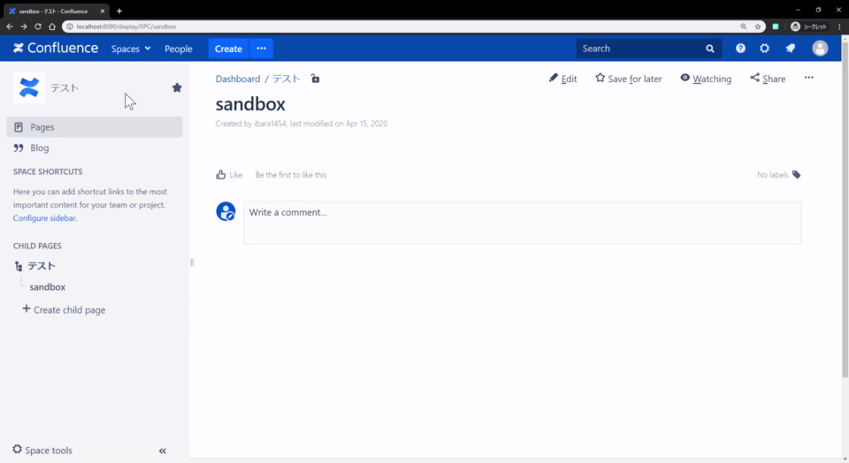
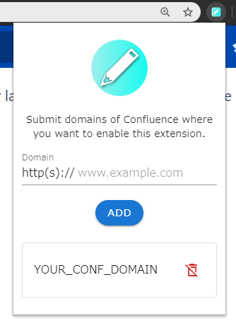
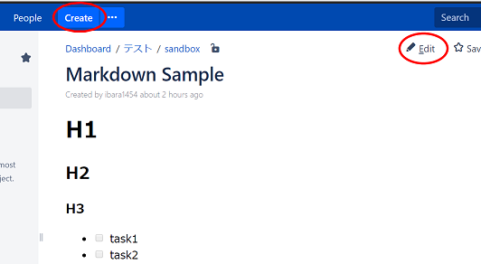

# Confluence markdown editor chrome extension

[](https://github.com/ibara1454/confluence-markdown-editor-chrome-extension/releases)
[](https://opensource.org/licenses/MIT)
[](https://github.com/ibara1454/confluence-markdown-editor-chrome-extension/actions?query=workflow%3Abuild)

A Chrome extension provides Markdown editor for Confluence.



## What's this

This project is proposed to provide a markdown editor in Confluence.

As known as [Atlassian Confluence](https://www.atlassian.com/software/confluence) has many convenience macros and features in the WYSIWYG editor.
But there is no way to use markdown like what you do in GitHub.

By install this extension, you may open a markdown editor in your documents.

## Feature

Support on Confluence version >= 6.13.11.

- Create / edit pages using markdown editor
- User custom styles (WIP)

## Usage

First, setup your Confluence's domain name to enable this extension in such domain. (i.e. `http://my.confluence.com`)



Create a new document / edit exising documents.



## Installation

### Chrome web store

(Not ready. Coming soon...)

### Build from source

Prerequisites: Node.js (`>=10.0.0`)

Install dependencies

```bash
$ npm install
```

Then build extension from sources

```bash
$ npm run build
```

By default, the extension will built into `dist` directory.
Load the extension from `chrome://extensions` page.

## Trouble shooting

### I saved my markdown document but which is not shown like the preview

Make sure your Confluence's ["HTML Macro" feature](https://confluence.atlassian.com/doc/html-macro-38273085.html) is enabled.
This extension is dependent on the "HTML Macro". If it is not enabled, please ask your administrator to enable this macro.

## Contributing

Since his project is still in progress, it is not ready to accept any pull request or issues.

## License

[MIT](LICENSE)

Copyright 2020 Chiajun Wang (ibara1454).

This software includes the work that is distributed in the Apache License 2.0.
