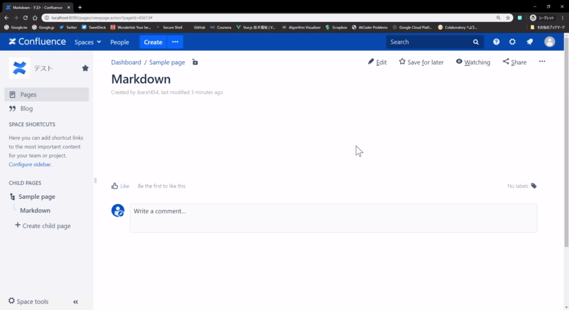

# Confluence markdown editor chrome extension

----

- [Confluence markdown editor chrome extension](#confluence-markdown-editor-chrome-extension)
  - [What's this](#whats-this)
  - [Feature](#feature)
  - [Installation](#installation)
  - [免責事項](#%e5%85%8d%e8%b2%ac%e4%ba%8b%e9%a0%85)
  - [既知バグ](#%e6%97%a2%e7%9f%a5%e3%83%90%e3%82%b0)
  - [Contribute](#contribute)

## What's this

## Feature

## Installation

（ストアに上がっていない拡張機能をパッケージ経由でインストール出来ないため、手動でインストールする必要がある）

1. ダウンロードしたアーカイブファイルを展開する
2. Chromeの拡張機能ページ(chrome://extensions/)を開く
3. 展開したフォルダをドロップしてインストールするか、または「パッケージ化されていない拡張機能を読み込む」でインストールする

## 免責事項

本拡張はまだ実験実装なため、不具合により引き起こした問題について、一切の責任を負わない。

## 既知バグ

TBD.

## Contribute

不具合報告等はissuesまで。

Maintainer: Chiajun Wang <ibara1454@gmail.com>
